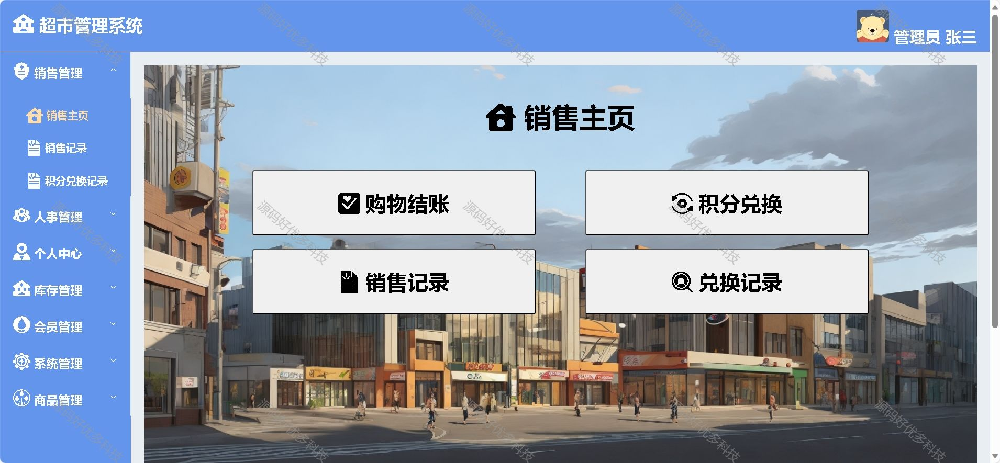
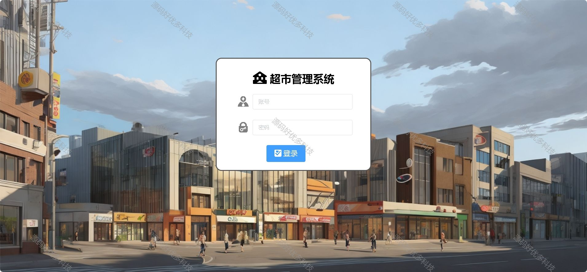
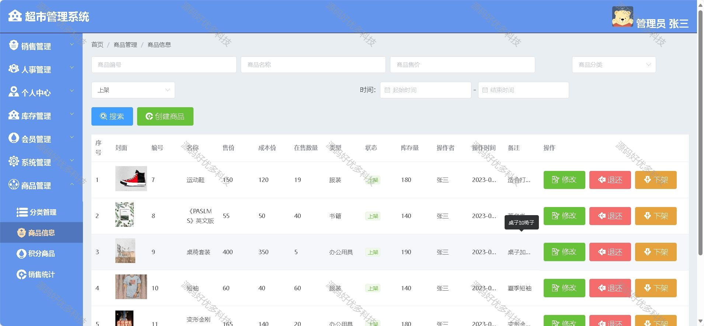
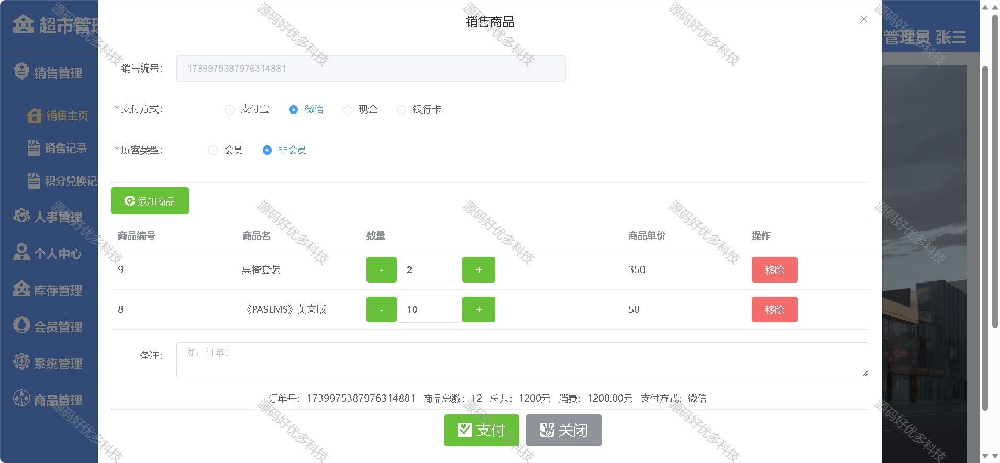
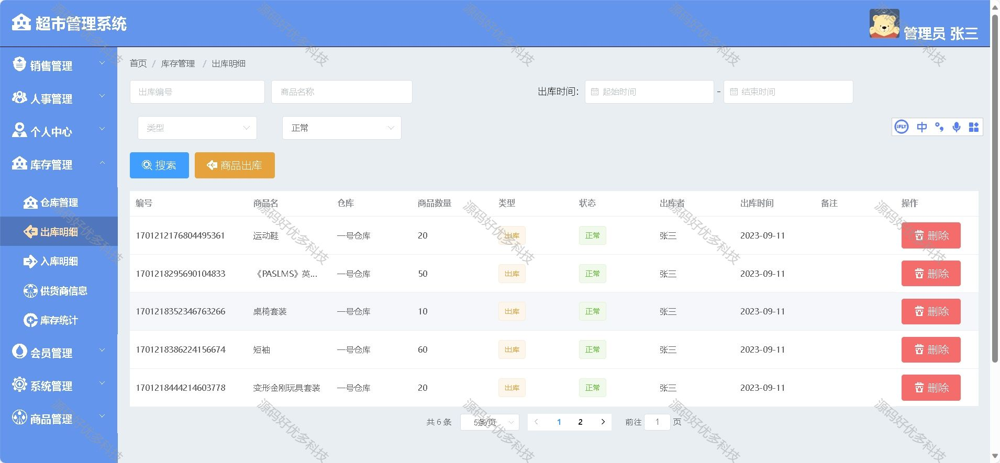
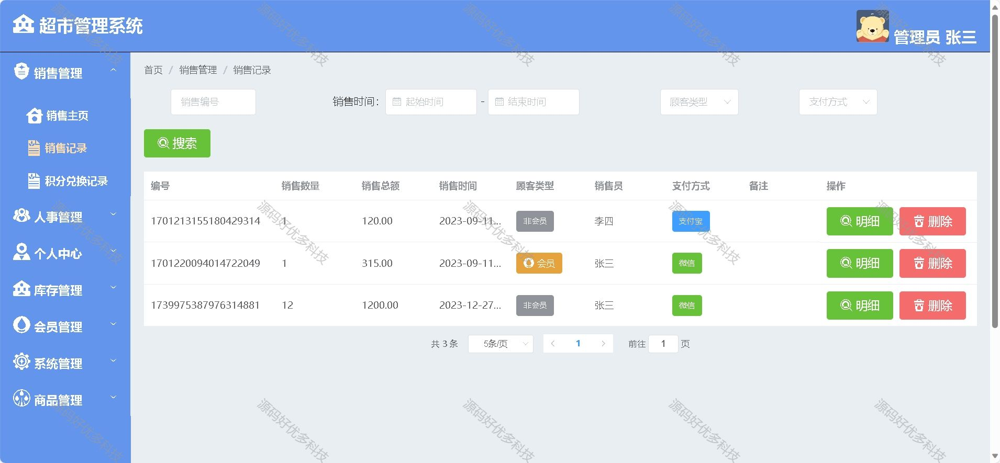
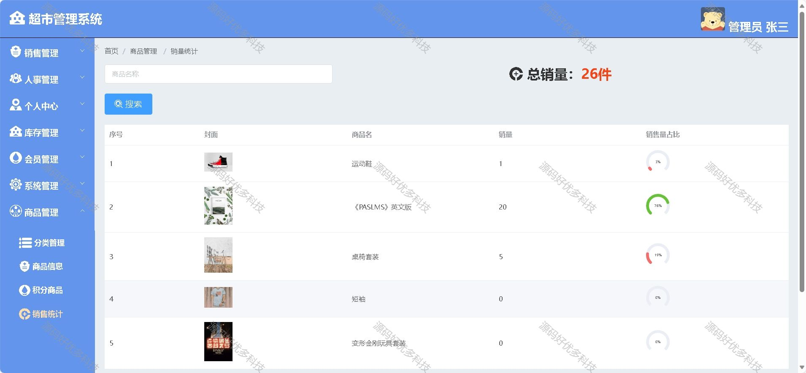
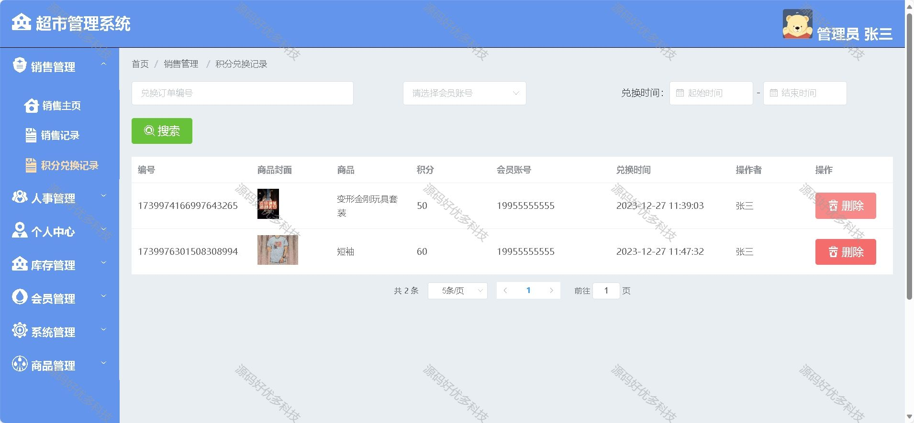
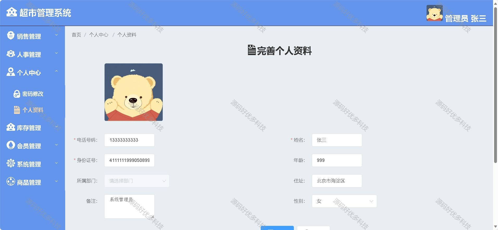
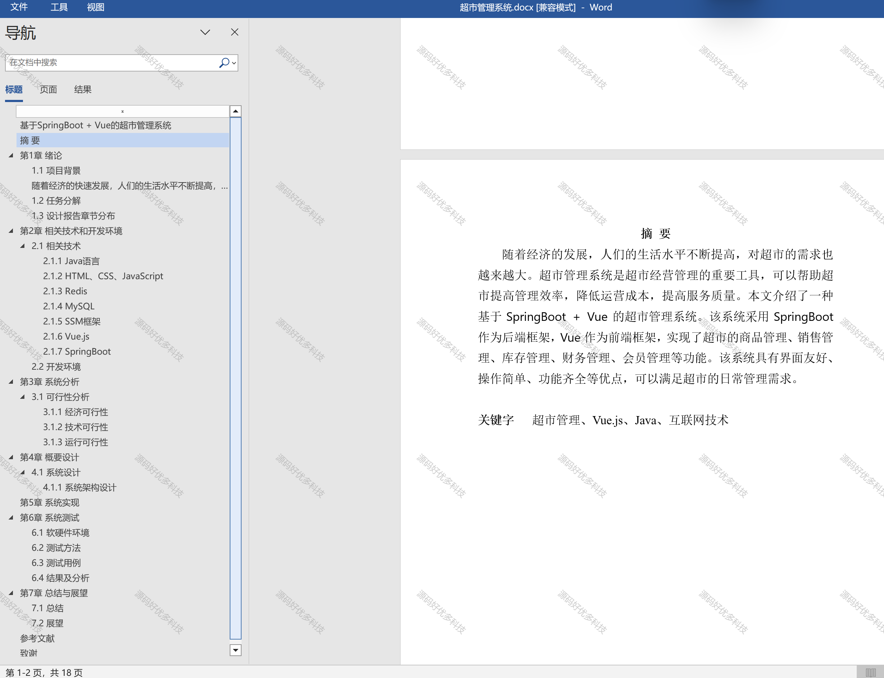

### 一、作品包含

源码+数据库+设计文档+PPT+全套环境和工具资源+部署教程

### 二、项目技术

前端技术：Html、Css、Js、Vue、Element-ui

数据库：MySQL

后端技术：Java、Spring Boot、MyBatis

### 三、运行环境

开发工具：IDEA/eclipse

数据库：MySQL8.0

数据库管理工具：Navicat10以上版本

环境配置软件： JDK1.8+Maven3.6.3

前端Nodejs：16

### 四、项目介绍

项目编号：springbootA007
随着经济的快速发展，人们的生活水平不断提高，对商品的需求也日益多样化。超市作为一种新型的零售业态，以其商品种类齐全、价格实惠、购物环境舒适等优点，深受消费者的喜爱。近年来，超市行业发展迅速，规模不断扩大，竞争也日益激烈。为了在激烈的竞争中立于不败之地，超市企业必须不断创新，提高管理水平，提升服务质量。
对于超市管理者来说，大量复杂的销售、进货、报损管理、供应商管理等难于通过传统的方法进行管理。超市管理系统正是对上述的问题而开发的，通过计算机系统来管理货品销售与进货的情况，可以解决大量商品信息的查询和管理，便于更好的进行商品管理，同时也为销售员提供方便
管理员可自由设置角色并分配权限，功能模块如下：
  用户模块
  销售主页（购物结账，积分兑换，销售记录，兑换记录）
  销售管理（销售主页，销售记录，积分兑换记录）
  人事管理（部门管理，员工管理）
  库存管理（仓库管理，出库明细，入库明细，供货商信息，库存统计）
  会员管理
  系统管理（角色管理，菜单管理）
  商品管理（分类管理，商品信息，积分商品，销售统计）

### 五、运行截图

